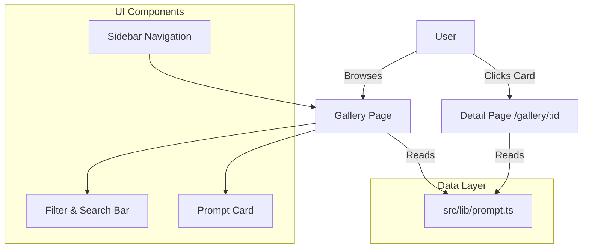

# AI Forge 🚀

AI Forge is a powerful Next.js application designed for AI prompt engineering and management. It serves as a centralized gallery for browsing, organizing, and refining AI prompts for various models like Midjourney, DALL-E, and Stable Diffusion.

## ✨ Features

- 🎨 **Prompt Gallery**: Browse a visually stunning collection of curated AI prompts.
- 🔍 **Smart Search & Filter**: Easily find prompts by category (Photography, 3D Art, Coding) or model (Midjourney, ChatGPT).
- 📋 **One-Click Copy**: Instantly copy prompt text to your clipboard.
- 📱 **Responsive Design**: Seamless experience across desktop and mobile devices.
- 🖼️ **Detail View**: Deep dive into prompt parameters, negative prompts, and reference images.

## 🛠️ Tech Stack

- **Framework**: [Next.js 16](https://nextjs.org/) (Turbopack)
- **Styling**: [Tailwind CSS](https://tailwindcss.com/)
- **UI Components**: [Shadcn/UI](https://ui.shadcn.com/)
- **Icons**: [Lucide React](https://lucide.dev/)
- **Language**: TypeScript

## 🧩 Architecture



## 🚀 Getting Started

First, run the development server:

```bash
npm run dev
# or
yarn dev
# or
pnpm dev
# or
bun dev
```

Open [http://localhost:3000](http://localhost:3000) with your browser to see the result.

## 📂 Project Structure

```
src/
├── app/              # Next.js App Router
│   ├── (app)/        # Main application layout
│   │   ├── gallery/  # Gallery feature
│   │   └── page.tsx  # Dashboard/Home
├── components/       # Reusable UI components
│   ├── gallery/      # Gallery-specific components
│   └── ui/           # Shadcn UI primitives
├── lib/              # Utilities and mock data
```

---

Built with ❤️ by the AI Forge Team.
